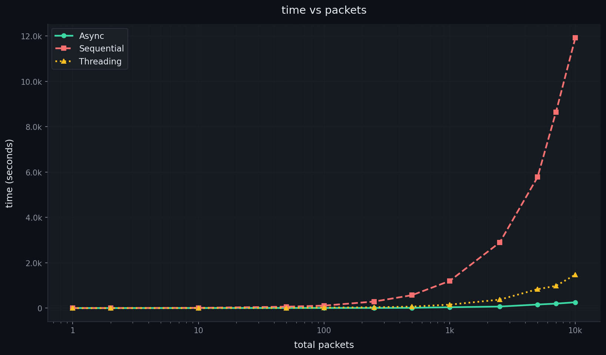
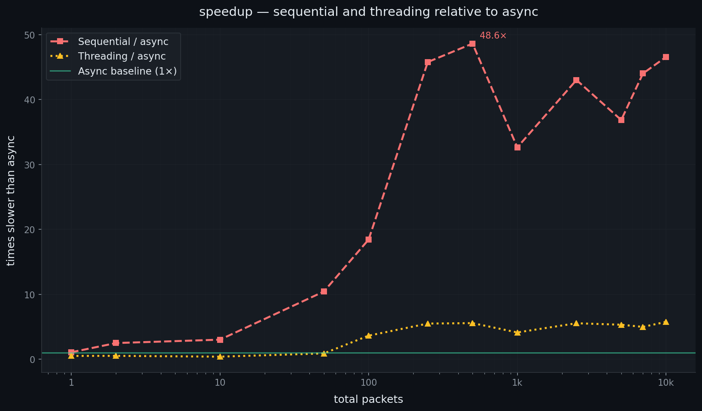
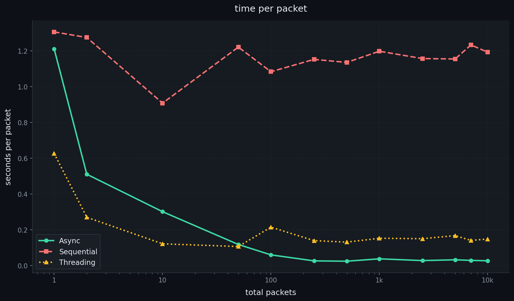

# HTTP Concurrency Benchmark: Async vs Threading vs Sequential

Kevin Russel - June 2026

A benchmark comparing three approaches to making HTTP requests at scale in Python — async (asyncio), threading, and sequential — across packet counts ranging from 1 to 10,000.

---

## Overview

The goal of this project is to measure and compare the real-world performance characteristics of three concurrency models when making large numbers of outbound HTTP GET requests:

- **Async** — `asyncio`-based event loop; all requests issued concurrently within a single thread
- **Threading** — Python `threading` module; each request runs in its own thread
- **Sequential** — standard `requests.get()` calls one after another, no concurrency

Each approach was tested at 12 packet counts: 1, 2, 10, 50, 100, 250, 500, 1000, 2500, 5000, 7000, and 10,000 requests. Results were recorded as total wall-clock time and saved to CSV.

---

## Project Structure

```
.
├── main.py               # Benchmark runner — runs all three approaches and saves CSVs
├── chart.py              # Chart generator — reads CSVs and outputs dark-mode PNGs
├── async_results.csv     # Raw results for the async approach
├── seq_results.csv       # Raw results for the sequential approach
├── thread_results.csv    # Raw results for the threading approach
└── charts/
    ├── chart1_time_vs_packets.png
    ├── chart2_speedup_ratio.png
    └── chart3_time_per_packet.png
```

---

## Requirements

- Python 3.8+
- `requests`
- `matplotlib`

Install dependencies:

```bash
pip install requests matplotlib
```

---

## Usage

### Running the benchmark

```bash
python main.py
```

Results are written to CSV files with the format:

```
Total_Packets,Total_Time
1,1.211...
2,1.019...
...
```

### Generating the charts

Open `chart.py` and set the three file paths at the top of `main()`:

```python
ASYNC_PATH  = 'async_results.csv'
SEQ_PATH    = 'seq_results.csv'
THREAD_PATH = 'thread_results.csv'
OUTPUT_DIR  = 'charts'
DPI         = 150
```

Then run:

```bash
python chart.py
```

Three PNGs will be saved to the `charts/` folder.

---

## Results

### Chart 1 — Time vs packets

Raw wall-clock time for each approach across all packet counts. The x-axis is logarithmic to show the full range clearly.



### Chart 2 — Speedup ratio

How many times slower sequential and threading are compared to async at each packet count. The teal baseline at 1× represents async. Anything above it is slower than async by that multiple.



### Chart 3 — Time per packet

Total time divided by packet count. Shows concurrency efficiency — a falling line means the approach is getting more done per unit time as concurrency kicks in. A flat line means no concurrency benefit.



---

## Key Findings

### Sequential is perfectly linear

Every sequential run confirms ~1.19 seconds per request with near-zero variance. The line on Chart 3 is flat across all packet counts — there is no concurrency, so the cost simply multiplies. At 10,000 packets this totals ~11,926 seconds (~3.3 hours).

### Threading wins at small counts, then falls behind

For 50 packets and below, threading is actually faster than async. At 1 packet, threading completes in 0.63s versus async at 1.21s — nearly 2× faster. This is because the asyncio event loop has startup overhead that only pays off once there is enough concurrent work to absorb it. Past ~100 packets, async overtakes threading decisively and never looks back.

### Async plateaus between 50 and 250 packets

This is the most striking result. 50 packets takes 5.85s. 250 packets takes 6.29s — five times the workload in essentially the same time. This near-flat region shows the event loop running all requests in parallel, bounded only by server response time (~1.2s). This is async doing exactly what it is designed to do.

### Threading degrades faster than expected at scale

Past 100 packets, threading time grows steadily. By 10,000 packets threading takes 1,475s — 5.8× slower than async's 256s. Python's GIL prevents true parallelism, and thread creation and scheduling overhead compounds. Chart 2 shows threading settling into a stable ~5–6× band relative to async from 500 packets onward.

### Async starts to degrade past 500 packets

The plateau breaks after 250–500 packets and async time begins climbing again. This is consistent with hitting OS-level socket or connection pool limits — the event loop is trying to open more simultaneous connections than the system or remote server will allow. Introducing an `asyncio.Semaphore` to cap the number of in-flight requests would flatten this tail back out.

### Important: always set a request timeout

During testing, a sequential run with 2500 packets stalled for over 70 minutes — well past the ~48 minutes predicted by the linear trend. The root cause was `requests.get()` with no `timeout` argument, which waits indefinitely if a server accepts the connection but never responds. With 2500 URLs the chance of hitting at least one unresponsive host is significant. Always pass a timeout:

```python
r = requests.get(url, timeout=10)
```

---

## Summary Table

| Packets | Async (s) | Threading (s) | Sequential (s) |
|--------:|----------:|--------------:|---------------:|
| 1       | 1.21      | 0.63          | 1.31           |
| 10      | 3.01      | 1.21          | 9.08           |
| 50      | 5.85      | 5.28          | 61.07          |
| 100     | 5.88      | 21.39         | 108.37         |
| 250     | 6.29      | 34.63         | 288.18         |
| 500     | 11.68     | 65.03         | 567.84         |
| 1,000   | 36.70     | 151.79        | 1,198.27       |
| 2,500   | 67.25     | 373.20        | 2,893.22       |
| 5,000   | 156.66    | 833.76        | 5,774.82       |
| 10,000  | 256.06    | 1,475.47      | 11,925.59      |

At 10,000 packets, async is **46.6× faster than sequential** and **5.8× faster than threading**.

---

## License

MIT